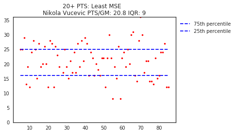

# NBA Data Analysis
### Bryce Mann

Just this past season the NBA as a whole made more 3-point shots (~27,000) than were made during the first 11 **years** (~23,000) after the 3-point line was introduced; the game is evolving drastically and rapidly, mainly due to the rise of so-called 'advanced stats' (metrics computed from basic counting stats) and teams increasing tendency to use the help of these analytics to make decisions. The NBA keeps extensive amounts of data on each player, team, and game, so I use some of it to try and answer a question about how the game is changing and another about the reliability of current players. For all of the code used to generate these answers, see [this Jupyter notebook](https://github.com/brycemann8334/Project3_DataScience/blob/master/project3/NotebookFinal.md).

## Acknowledgements
[stats.nba.com](stats.nba.com) is the source of all of the data I used. I want to give credit and thanks to swar, who created the nba_api python library that allows me to easily access the data (found on his github, [here](https://github.com/swar/nba_api)).

## Defense, who needs it?
### It is a widely accepted narrative among analysts that offense is becoming more important to team success and the league will continue to trend that way. Is it true?
To try and answer this question I looked at Offensive and Defensive efficiency. These are advanced metrics that started to be collected in the 1996 season and are a measure of how many points a team scores and gives up for every 100 possessions. In order to control for each season I computed the z-score of each efficiency value and kept them in terms of standard deviations. To start to answer this question, I produced plots like the one below.

*Notice that the y-axis is inverted; that's just an aesthetic decision so that teams with good offenses and good defenses are in the upper right quadrant.*

I am interested in how these two metrics can predict a team's success (which I define as their rank in the league standings, where 1 is the best), so each dot on the plot has a size proportional to their final rank. Looking at the upper right hand quadrant, we see what we expect and that is teams with good offenses and defenses tend to be more successful.

Now I can try to answer my question by running multiple regression with the efficiencies as independent variables and teams final ranking as the dependent variable for each year. This gives me a coefficient pair for each season; I then divided the offensive coefficient by the defensive coefficient to get a ratio. Since all of the efficiencies were standardized this ratio tells us the relative importance of offense and defense in predicting the final standings. This allowed me to plot the time series below.

*All of the ratios are negative because offense and final rank are negatively correlated. Below the blue line means that year it was more important to have a good offensive, and vice versa.*

Included on that plot were 1st and 2nd degree fits to the ratios. While there is a negative trend, low R^2 values and relatively high p values show that at least for the years we have data it is not easy to predict what the ratio will be (due to the oscillation the ratios go through) and that this negative trend is not statistically significant and could be due to random variation.

### Conclusion
So it looks like for the time being we can't definitively say that one side of the ball is becoming more important than the other; rather it seems like for most years the ratios bounce back and forth over the middle line. One thing to keep an eye though would be to keep monitoring the ratios of the coming seasons; the last 4 years see the most sustained linear trend in the entire dataset, as the ratios go from about -.8 to -1.3 (+15% per year). This is a very sharp increase in offensive predictive importance, and if this is the beginning of a longer trend the analysts could yet be proven right.

## Who is (in)consistent?
### For stats (specifically points) taken on a game by game basis, who are the most and least consistent performers in the NBA?

Looking at players' per game averages is the easiest way to get some information about them, but those numbers don't say much about how they perform over on a game by game basis. In order to try and quantitatively answer who are the most and least consistent performers I collected the full game box scores for each player in the previous season who played more than 41 games (half of the season). For each game in their season I ran linear regression on the 20 games around it, with points being the dependent variable. For that model I then calculated the mean squared error that the model generates with the actual point values and stored every mse value. I thought fitting a line to the rolling 20 game chunks would be better than just calculating the average of the games because fitting a line allows streaks of hot and cold games within a season to be accounted for. I then am able to select the player with the highest average mean squared error and the player with the lowest. These 2 players can be seen below.

*Because people like round numbers, 20 PTS/GM is normally thought of as the baseline for being an 'elite' scorer so I only looked at players who met this benchmark. The IQR plotted is for all of their games in the season.*

### Conclusion
Looking at the figure, it is pretty interesting to see just how different these two are in terms of game by game scoring. Vucevic has (relatively) clean trends we can see in his game, as throughout the time series there are areas of distinct linear behavior. Also, the majority of values outside of the IQR are within 5 points of either boundary, which is a tight distribution to make him the most consistent 20 PT/GM scorer from this past season.

Kemba Walker, on the other hand, is known as a very streaky player so it is reassuring to have him come up as the most inconsistent. It also makes sense, when looking at his games from the season: his IQR range is only slightly bigger than Vucevic's, but the spread of values both inside and outside those bounds is wildly bigger. Kemba also doesn't have as many of the noticeable linear trends that we saw before, many of his games swing up or down pretty significantly on a game-by-game basis.

### Future Work
The cool thing about this notebook is that we are not limited to looking at only points: we can look at any stat that is tracked on a game by game basis. We also don't need to only look at the extreme cases, it could also be used as a method of comparison. This could potentially prove to be an effective information and evaluation tool.
